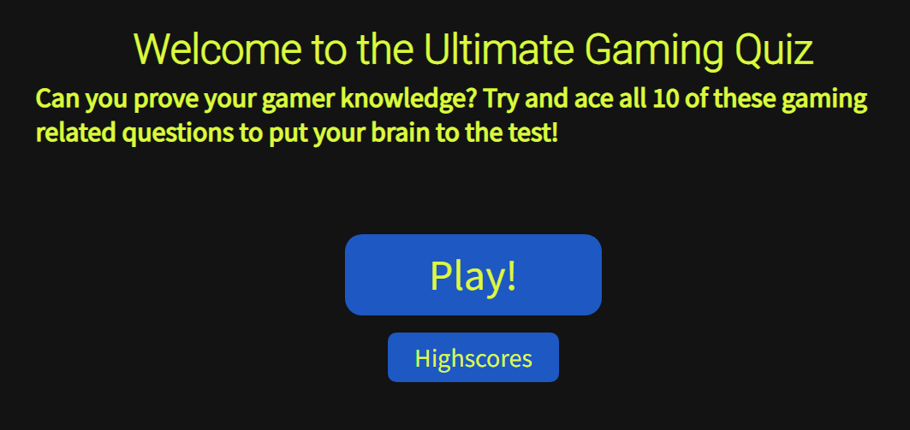

# Ultimate Gaming Quiz

My site is created with the intention of delivering an entertaining source of media to users. I have done this by creating an interactive quiz about video games that will challenge users. I designed the site with an old school arcade scheme in mind, this plays on the nostalgia that users would have around video games. Any user that goes on the site will be able to easily interact with all the sites functions. IF CAN BE DONE Users will also be able to store a personal highscore to encourage sharing with friends and attempting to beat each other. This will in turn create a social aspect around the quiz.

[Link to Deployed site](https://britishbambi.github.io/ultimate-game-quiz/index.html)

## UX

I have elected for a simple font style on the site. The main headings are using Heebo and the body is using Source Sans Pro. I experimented early on with some more "gaming" styled fonts which were pixilated in nature. However I find that the user prefers the ability to read everything clearly, so I went for a more traditional font. Heebo has a slightly larger weight than the body so that the text subtly stands out more against the rest of the page. The fonts I have used provide an easy user experience and stand out well against the colour scheme I have used.

The colour scheme of the site uses a slightly light black and bright yellow. This ensures that all the text and content of the site stands out and can easily be read. The bright yellow is based on old arcade style colour schemes, almost throwing back to games like Pacman. This is intentionally designed this way to play into the video game aspect of the quiz while maintaining a positive contrast score. Some other elements such as the play button and the actual quiz options use a bright blue and white/yellow scheme. The blue also plays into the arcadey feel of the site and again ensures that all the content can be read by all users.

Wireframes of my proposed project designs can be seen bellow:

As you can see I stuck pretty closely to the orignal design of my wireframes. However I initally intended on the highscores button using JS to make them appear on screen. Instead I elected to create a new screen entirely which would use local storage to carry over the saved highscore list and display it to the user. This proved to be a very functional choice and did not create any more extra clicks for the user to make.

User Stories as followed:

### New Users

* I am wanting to engage in a gaming quiz.
* I want to register my score onto the high score list.
* I want to see what other user's have scored in the quiz.

### Returning User

* I am wanting to improve my previous score.
* I want to see if any other users have beaten my high score.
* I am coming to see if there are any new questions/quizes.

## Existing Features

### Welcome Screen

When the site is initially loaded the user is greeted with a simple heading and site description. This way the user isn't overblown with the quiz when they first enter the site. It also features a play button, which gives the user total control for when the quiz is loaded. There is also a high score button, when which pressed will take the user to the score screen, negating the need to complete the quiz first. The play and highscore buttons are fully interactive as well and highlights with a mouse pointer so the user can easily make out that it is a button. By using the blue background they also stand out immedietly when the page is loaded. 

### Home button

From the quiz screen, a simple home button has been made available in the top left of the screen. Rather than use a full navbar for site navigation a simple home button takes the user in between the pages of the website with ease. It uses the blue and yellow font style similar to the play button so that it can easily be located as soon as the page is loaded. This way the user isn't looking around or defaults to the back button as they have the button made obvious within seconds.

### High Score Screen

The site also features the ability to locally store high scores and display them using an array in a list. If the user wants to see their own highscore compared to other local ones they can be accessed using the High Score button on the home page. The high score screen will display the top 5 highest scores on the local storage. If a new score is saved that is higher than the lowest then the bottom score will be spliced out and the new score entered.

### 404 Page

The user is automatically brought to the 404 error page whenever they go to a page that does not exist. This is usually by mistyping something into the address bar or by following an incorrect link. In the case that a user makes the mistake of mistyping the page in the bar, I have created my own 404 page which follows the styling of the rest of the site. As well as this it also features a simple message to explain to users what has happened. Then they can use the provided button which will bring them back to the home page. This ensures they stay within the realms of the site and don't get lost or frustrated.

### Question Counter

While the user is progressing through the quiz, a counter will display the current question and how many in total there are. This is a simple but effective feature which means the user does not lose their place in the quiz. It also gives them a clear indicator for how many questions they have left. This way they do not find themselves lost or wondering how long they have to play the game for.

### Quiz 

The main quiz of the site features a very large UI and functional colour scheme. The question is displayed at the top in a Span ensuring that it stands out more than the other text on the screen. The choices for answers are displayed in front of a white background with blue text. This makes it very easy for the user to read the content and make their selection. The letter for each choice is also in the container to the left of the choice. Using the oposite colour scheme to the option text I make the entire boundry of the option stick out. When the user hovers over an answer their cursor will change to a pointer to clearly indicate interaction aswell. When the user gets an answer right or wrong the answer will light up green or red to provide immediate feedback to the user.

### Score Indicator

At the bottom of the quiz a live counter will show the user how many questions they have got right or wrong. The green/red text before the counter also provides some feedback to the good/bad result. This way the user will always have an idea of how well they are performing throughout the quiz. The value of their final score will also be saved for highscores so knowing what it is throughout lets them know if it is high score worthy.

## Future plans

Add more catagories for the quiz that the user can select between.

Script the ability to chose random questions from an array so that each user gets different questions each time. However, this may cause issues for highscores as it becomes unfair and random. To combat this a difficulty selection could also be made. From Easy, Medium and Hard.

Extending the quiz out to more questions and adding the ability to earn more score by getting a combo of correct questions. This will create a higher skill ceiling and allow users to compete more on the highscores.

## Testing

Index/Home Validation:

End Screen Validation:

High Score Screen Validation:

CSS Validation:

JS Validation:

Using JSHint I was able to ensure that there was no warnings with any of my js files. I adjusted my files based on the feedback it gave me, which was primarly adding semi-colons.

## Bugs

During the early stages of development I had issues with getting my questions to display. They would initially come up as "undefined", so to figure this out I had to do some tinkering. I found that my issue was the code trying to display the question from the html element also called "question". I changed around the names and tried different orders until it would rewrite the HTML element with the "questions" array. 

While devloping gitpod ran into issues displaying a preview of the site on a local network. To get around this I had to restart the workspace multiple times so that it would function correctly. I then also seeked out a new extension that would improve my preview experience. By downloading Live Server, any changes I made would refresh live to me on my other monitor. This made the flow of design and experimenting much easier.

Towards the final stages while creating the high score list I encountered some blue screen errors on my PC. To combat this unexpected issue I began to save and commit my efforts more often. Fortunatly there were no more crashes during development and I was able to complete the rest of the script without any further crashes.

## Existing Bugs

## Deployment

### Site Creation

To begin creating my website I used the Code Institute template by navigating [here](https://github.com/Code-Institute-Org/gitpod-full-template) and clicking "Use this Template".

Once this was done I was able to simply create a new repository from the template and add it to my profile. I named my repository and clicked the create repository from the template button.

### Site Deployment
The Steps to Deploy my site were as followed:

1. Log into GitHub and find my site repository
2. Locate the repository settings button located above the repository content and click on it.
3. Scroll down to the GitHub Pages section.
4. Change the source drop down menu from "none" to "main".
5. Click Save and await site deployment using the provided link to access site once it was live.

## Technologies Used

HTML

CSS

Javascript

Google Fonts

Gitpod

Live Server (Gitpod extension)

Github

## Credits

Quiz questions were taken from:

https://icebreakerideas.com/video-game-trivia/

## Acknowledgements
Understanding of how to put project into place thanks to Sitepoint:

https://www.sitepoint.com/simple-javascript-quiz/#whatsnext

Refeshed knowledge of all symbols and how to apply to project found on this stackoverflow post:

https://stackoverflow.com/questions/9549780/what-does-this-symbol-mean-in-javascript

Ability to add a timeout learned at w3 schools:

https://www.w3schools.com/jsref/met_win_settimeout.asp

Session storage applied to script using this as guidance:

https://developer.mozilla.org/en-US/docs/Web/API/Window/sessionStorage

Was able to store an array to local storage learning through stackoverflow:

https://stackoverflow.com/questions/3357553/how-do-i-store-an-array-in-localstorage

Grew my understanding of sorting arrays via Javascript module and this W3 lesson:

https://www.w3schools.com/js/js_array_sort.asp

Used arrow functions after reading up here:

https://developer.mozilla.org/en-US/docs/Web/JavaScript/Reference/Functions/Arrow_functions

Array mapping witth functions modified from:

https://www.freecodecamp.org/news/javascript-map-how-to-use-the-js-map-function-array-method/

A lot of the structure and understanding was thanks to the Love Maths project.

Lots of functions and syntax I learned on my University course at the University at York from 2016-2017.

Thanks to the Code Institute javascript module for teaching me the functionality and use of javascript.

Thank you to my mentor for guidance and feedback that allowed me to make the best project I could.