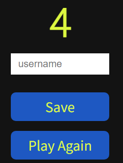

# Ultimate Gaming Quiz

My site is created with the intention of delivering an entertaining source of media to users. I have done this by creating an interactive quiz about video games that will challenge users. I designed the site with an old school arcade scheme in mind, this plays on the nostalgia that users would have around video games. Any user that goes on the site will be able to easily interact with all the sites functions. Users will also be able to store a personal highscore to encourage sharing with friends and attempting to beat each other. This will in turn create a social aspect around the quiz.

[Link to Deployed site](https://britishbambi.github.io/ultimate-game-quiz/index.html)

## UX

I have elected for a simple font style on the site. The main headings are using Heebo and the body is using Source Sans Pro. I experimented early on with some more "gaming" styled fonts which were pixilated in nature. However I find that the user prefers the ability to read everything clearly, so I went for a more traditional font. Heebo has a slightly larger weight than the body so that the text subtly stands out more against the rest of the page. The fonts I have used provide an easy user experience and stand out well against the colour scheme I have used.

The colour scheme of the site uses a slightly light black and bright yellow. This ensures that all the text and content of the site stands out and can easily be read. The bright yellow is based on old arcade style colour schemes, almost throwing back to games like Pacman. This is intentionally designed this way to play into the video game aspect of the quiz while maintaining a positive contrast score. Some other elements such as the play button and the actual quiz options use a bright blue and white/yellow scheme. The blue also plays into the arcadey feel of the site and again ensures that all the content can be read by all users.

Wireframes of my proposed project designs can be seen bellow:

As you can see I stuck pretty closely to the orignal design of my wireframes. However I initally intended on the highscores button using JS to make them appear on screen. Instead I elected to create a new screen entirely which would use local storage to carry over the saved highscore list and display it to the user. This proved to be a very functional choice and did not create any more extra clicks for the user to make.

User Stories as followed:

### New Users

* I am wanting to engage in a gaming quiz.
* I want to register my score onto the high score list.
* I want to see what other user's have scored in the quiz.

### Returning User

* I am wanting to improve my previous score.
* I want to see if any other users have beaten my high score.
* I am coming to see if there are any new questions/quizes.

## Existing Features

### Welcome Screen

When the site is initially loaded the user is greeted with a simple heading and site description. This way the user isn't overblown with the quiz when they first enter the site. It also features a play button, which gives the user total control for when the quiz is loaded. There is also a high score button, when which pressed will take the user to the score screen, negating the need to complete the quiz first. The play and highscore buttons are fully interactive as well and highlights with a mouse pointer so the user can easily make out that it is a button. By using the blue background they also stand out immedietly when the page is loaded. 

### Home button

From the quiz screen, a simple home button has been made available in the top left of the screen. Rather than use a full navbar for site navigation a simple home button takes the user in between the pages of the website with ease. It uses the blue and yellow font style similar to the play button so that it can easily be located as soon as the page is loaded. This way the user isn't looking around or defaults to the back button as they have the button made obvious within seconds.

### High Score Screen

The site also features the ability to locally store high scores and display them using an array in a list. If the user wants to see their own highscore compared to other local ones they can be accessed using the High Score button on the home page. The high score screen will display the top 5 highest scores on the local storage. If a new score is saved that is higher than the lowest then the bottom score will be spliced out and the new score entered.

### 404 Page

The user is automatically brought to the 404 error page whenever they go to a page that does not exist. This is usually by mistyping something into the address bar or by following an incorrect link. In the case that a user makes the mistake of mistyping the page in the bar, I have created my own 404 page which follows the styling of the rest of the site. As well as this it also features a simple message to explain to users what has happened. Then they can use the provided button which will bring them back to the home page. This ensures they stay within the realms of the site and don't get lost or frustrated.

### Question Counter

While the user is progressing through the quiz, a counter will display the current question and how many in total there are. This is a simple but effective feature which means the user does not lose their place in the quiz. It also gives them a clear indicator for how many questions they have left. This way they do not find themselves lost or wondering how long they have to play the game for.

### Quiz 

The main quiz of the site features a very large UI and functional colour scheme. The question is displayed at the top in a Span ensuring that it stands out more than the other text on the screen. The choices for answers are displayed in front of a white background with blue text. This makes it very easy for the user to read the content and make their selection. The letter for each choice is also in the container to the left of the choice. Using the oposite colour scheme to the option text I make the entire boundry of the option stick out. When the user hovers over an answer their cursor will change to a pointer to clearly indicate interaction aswell. When the user gets an answer right or wrong the answer will light up green or red to provide immediate feedback to the user.

### Score Indicator

At the bottom of the quiz a live counter will show the user how many questions they have got right or wrong. The green/red text before the counter also provides some feedback to the good/bad result. This way the user will always have an idea of how well they are performing throughout the quiz. The value of their final score will also be saved for highscores so knowing what it is throughout lets them know if it is high score worthy.

## Future plans

Add more catagories for the quiz that the user can select between.

Script the ability to chose random questions from an array so that each user gets different questions each time. However, this may cause issues for highscores as it becomes unfair and random. To combat this a difficulty selection could also be made. From Easy, Medium and Hard.

Extending the quiz out to more questions and adding the ability to earn more score by getting a combo of correct questions. This will create a higher skill ceiling and allow users to compete more on the highscores.

I would like to add the ability to see what the correct answer to a question was after a user guesses wrong. However this does cause the issue of making it too easy for the user to get 10 for the high scores immedietly after. Again this could be combated with random questions each time to balance this.

## Testing

I have ensured that the site works across a large number of devices. While also using the inbuilt responsive devices on dev tools I used an Ultrawide monitor, a 1440p monitor, a OnePlus 8, and an iPhone 8 mobile device. I could find no issues on these devices as compared to the usual dev tools version.

All Navigation links lead to the correct pages. Any link/button hovered over also has some visual feedback to the user to indicate that it is a link.

I performed extreme testing on every interactive element of the website. I had to make sure that every function was working intended and couldn't be broken when certain actions are performend. I will detail all the interactive elements bellow and how they work.

### Home Page / Quiz

#### Play Button

The user goal of the play button is to display the quiz and begin playing the quiz. This all works correctly. When the play button is clicked it will run the StartGame function. This will hide the previous elements first seen on the home screen, such as the description and play button. Once the previous elements have been hidden, it will then unhide the quiz elements. This is done by using a hidden class which can be essentially toggled to show certain elements when the class is needed. This means technically that all the quiz elements have been loaded when the user goes to the home screen, they are just invisible. This means the user does not load to a seperate page for the quiz. This removes any form of loading screen in between loading and playing the quiz. Now that the elements have been drawn, the questions will be loaded from an array and the nextQuestion function will be called. 

### Quiz

When the quiz is loaded from the startGame function it will then beging the nextQuestion function immedietly. This way the user is shown a question as soon as the quiz is loaded. Firstly the script will make sure that there are available questions. It does this by seeing if the availableQuestions variable is equal to 0 or if the maximum questions have been reached. If this is the case then the user will be brought to the end screen. However since the quiz has just loaded, the quiz will display correctly. The question counter will begin at 1 to match the question as well. This will be compared to the maximum questions variable so the user can clearly mark their progress in the quiz. 

The current question will first be loaded using a math random based on the available questions. This will draw a random question out of the available questions list. This list is edited after every question is answered as it is taken out of this availableQuestions array. The html for the question will then be written with the random question. Something similar happens for each of the question choices. Instead of being random however, it will take each choice from the questions array and display it with the number representing it. The number will be used to match with the correct answer.

Now that all the elements have been drawn we need to find out if a selected choice is the correct one and feed this back to the user. An event listener will first register the clicked target as the selected choice. It will also listen out for the number that represents the selected choice. The code will then see if the number representing the correct answer matches the selected choice. It will then learn what class to apply if the answer is correct or incorrect. As well as applying a class the relevent score counter will have 1 added to it. This way a user gets live feedback to their choice in the counters.

First when an answer is correct the user will recieve 1 point added onto their score. This score will be important later as it will be saved at the end of the game to register onto the high score. Then a class will be applied. The correct class will highlight the selected choice with a green background and white text, this makes it very apparent to the user that they got it right.

The same thing happens when the answer is incorrect. However a red background is drawn to indicate that the answer is wrong.

Now a short timeout will occur so that the user has time to process their response rather than the next question being loaded immediatly. At the end of this timeout the class will be removed so that the green/red background does not linger on a choice in the next question. Now that the score has been added and the user knows the result of their choice, we can call the next question and repeat this entire process.

### End Screen / Score Saving

After all the available questions have been spliced and cycled through the previous function will save the final score to the local storage. Now the user will be brought to an end screen where they can save this score with a username. First of all we have disabled the save button until an input has been entered into the username field. Now when the save button is pressed it will save the score into the highscores array with the name and score. If there was no previous high scores then it will create a new blank array where the highscores will be saved to. These highscores will be sorted in order of highest score. 

There will only be a max of 5 highscores in the final array. So right at the end it will check to see if it qualifies as a new high score and spilces out the previous bottom score. If the score does not qualify then the score will not be shown on the final high score list. By using JSON.Parse we also convert these values into a string so that we can display them later. Now that the score has been saved to the array we bring the user back to the home screen. However if the user does not wish to save their score we can press the play again button which will skip all the functions and bring the user to the home straight away.

### High Scores Screen

The high score screen is very simple and functions as intended. When the page is loaded the highscores array we created early will be written to the page HTML. If there is no existing array then an empty one will show instead essentially showing nothing to the user. Now the loaded highscores will be mapped out into an unordered list. The name will be shown with the score next to it. This all displays as a string which is the only way we would be able to see it as intended.

### Code Validation

Index/Home Validation:

End Screen Validation:

High Score Screen Validation:

CSS Validation:

JS Validation:

Using JSHint I was able to ensure that there was no warnings with any of my js files. I adjusted my files based on the feedback it gave me, which was primarly adding semi-colons.

### External Links

There are currently no external links on my website. However if I were to add social media links I would ensure that they opened in a new tab and that they all worked correctly.

### Chrome Dev Tools

During development, I relied heavily on dev tools to make live adjustments to the site. This allowed me to make small changes without affecting my code and needing to reverse engineer any mistakes. Using dev tools I was also able to view my site across several different resolutions and screen sizes. This helped me identify where my site may need to be changed to work correctly.

### Lighthouse Dev Tools
I was able to use Lighthouse from Chrome Dev Tools throughout development to ensure my Website was hitting my goals. I was able to ensure best practices were being used and that my website performance was high-scoring. From the screenshot below you can see that SEO and Accessibility was also greatly considered in site production.

## Bugs

During the early stages of development I had issues with getting my questions to display. They would initially come up as "undefined", so to figure this out I had to do some tinkering. I found that my issue was the code trying to display the question from the html element also called "question". I changed around the names and tried different orders until it would rewrite the HTML element with the "questions" array. 

While devloping gitpod ran into issues displaying a preview of the site on a local network. To get around this I had to restart the workspace multiple times so that it would function correctly. I then also seeked out a new extension that would improve my preview experience. By downloading Live Server, any changes I made would refresh live to me on my other monitor. This made the flow of design and experimenting much easier.

Towards the final stages while creating the high score list I encountered some blue screen errors on my PC. To combat this unexpected issue I began to save and commit my efforts more often. Fortunatly there were no more crashes during development and I was able to complete the rest of the script without any further crashes.

At the end of development I had issues with the links working on the deployed version of the site. To fix this I had to go to my script files and remove the forward slashes before my page links. This would work on a local port but required them to be removed for the live version.

## Existing Bugs

At the and of development I was able to identiy and make sure any bugs were fixed. If there are any future bugs that are discovered I would return to the project and make sure they are fixed.

## Deployment

### Site Creation

To begin creating my website I used the Code Institute template by navigating [here](https://github.com/Code-Institute-Org/gitpod-full-template) and clicking "Use this Template".

Once this was done I was able to simply create a new repository from the template and add it to my profile. I named my repository and clicked the create repository from the template button.

### Site Deployment
The Steps to Deploy my site were as followed:

1. Log into GitHub and find my site repository
2. Locate the repository settings button located above the repository content and click on it.
3. Scroll down to the GitHub Pages section.
4. Change the source drop down menu from "none" to "main".
5. Click Save and await site deployment using the provided link to access site once it was live.

## Technologies Used

HTML

CSS

Javascript

Google Fonts

Gitpod

Live Server (Gitpod extension)

Github

Github Pages

Chrome Dev Tools

## Credits

Quiz questions were taken from:

https://icebreakerideas.com/video-game-trivia/

Favicon taken from:

https://icon-library.com/icon/game-controller-folder-icon-19.html

## Acknowledgements
Understanding of how to put project into place thanks to Sitepoint:

https://www.sitepoint.com/simple-javascript-quiz/#whatsnext

Refeshed knowledge of all symbols and how to apply to project found on this stackoverflow post:

https://stackoverflow.com/questions/9549780/what-does-this-symbol-mean-in-javascript

Ability to add a timeout learned at w3 schools:

https://www.w3schools.com/jsref/met_win_settimeout.asp

Session storage applied to script using this as guidance:

https://developer.mozilla.org/en-US/docs/Web/API/Window/sessionStorage

Was able to store an array to local storage learning through stackoverflow:

https://stackoverflow.com/questions/3357553/how-do-i-store-an-array-in-localstorage

Grew my understanding of sorting arrays via Javascript module and this W3 lesson:

https://www.w3schools.com/js/js_array_sort.asp

Used arrow functions after reading up here:

https://developer.mozilla.org/en-US/docs/Web/JavaScript/Reference/Functions/Arrow_functions

Array mapping witth functions modified from:

https://www.freecodecamp.org/news/javascript-map-how-to-use-the-js-map-function-array-method/

A lot of the structure and understanding was thanks to the Love Maths project.

Lots of functions and syntax I learned on my University course at the University at York from 2016-2017.

Thanks to the Code Institute javascript module for teaching me the functionality and use of javascript.

Thank you to my mentor for guidance and feedback that allowed me to make the best project I could.